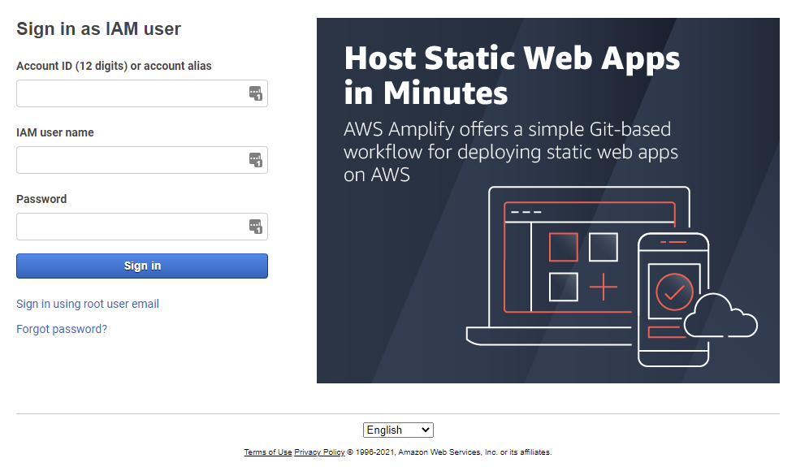
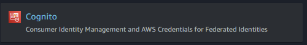
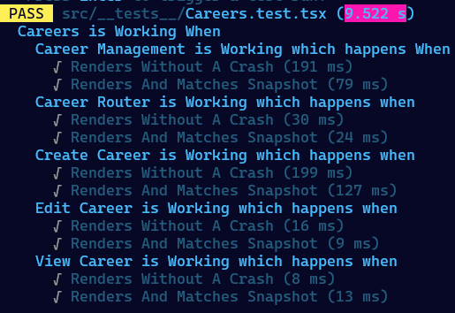
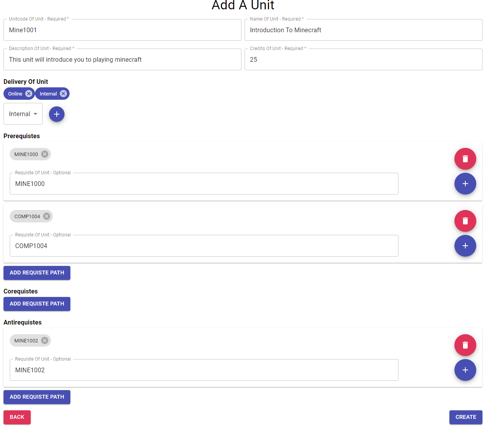

# Curtin Biomedical Course Planner - Content Management System
Last Update: 19/09/2021  
Author: Jonathan (19779085)
## Contents
- [What Is The Content Management System?](#What-is-The-Content-Management-System)
- [How Do I Create Accounts?](#How-Do-I-Create-Accounts?)
- [How Do I Deploy This?](#How-Do-I-Deploy-This?)
- [How Do I Test This?](#How-Do-I-Test-This)
- [Can I Change The URL?](#Can-I-Change-The-URL?)
- [How Do I Create A Unit?](#How-Do-I-Create-A-Unit?)
- [How Do I Create A Major?](#How-Do-I-Create-A-Major?)
- [How Do I Create A Specialization?](#How-Do-I-Create-A-Specialization?)
- [How Do I Create A Career?](#How-Do-I-Create-A-Career?)
- [How Do I Create A Trait?](#How-Do-I-Create-A-Trait?)
- [How Does The CSV System Work?](#How-Does-The-CSV-System-Work?)

## What is The Content Management System?

A Content Management system allows users to input data into software, its essentially the visual frontend to where you store your data, [DynamoDB](https://aws.amazon.com/dynamodb/), it requires accounts for users to be authorized users to be allowed to add/delete/update data in the system.

## How Do I Create Accounts?

First you will need your AWS credentials, if you have forgotten your AWS credentials you can navigate to the [AWS support page and request a password reset](https://aws.amazon.com/premiumsupport/knowledge-center/recover-aws-password/).  
  
Then you will need to logon to the [AWS Web Console](https://console.aws.amazon.com/console/home) using those credentials, your account ID will be in a email you recieved previously.
  
  
Then navigate to AWS Cognito either by searching it and selecting the red image as displayed below, or [click here to navigate there directly](https://ap-southeast-2.console.aws.amazon.com/cognito/users/?region=ap-southeast-2#/?_k=qje9cj). Once you have navigated to AWS Cognito be sure to select **User Pools** and either the Dev/Prod Staff User Pool

Once in the pool you can select on the left hand side of the screen under **General Settings**, **Users and Groups**. From here you can create a user using the graphical interface. If you require assistance please read the [Cognito Documentation](https://docs.aws.amazon.com/cognito/latest/developerguide/managing-users.html)

## How Do I Deploy This?

To deploy this it is fairly simple, you just need to navigate into **CMS Frontend** and run the BuildTestDeploy.sh (This will require bash unfortunately as bitbucket does not support powershell.)  
  
However to make it even easier if you read the bitbucket-pipelines.yml you can see step by step how the AWS resources are deployed. If you need assistance understanding the pipeline file Atlassian provides [great documentation on the subject.](https://support.atlassian.com/bitbucket-cloud/docs/configure-bitbucket-pipelinesyml/).

## How Do I Test This

To test the CMS Frontend navigate into **CMS Frontend** and type into your terminal/console:  
`yarn install`  
`yarn test`  
It should produce the follow output to tell you the product is working as intended (Note: yours will be larger as to save space alot of it has been omitted):

## Can I Change The URL?

Sure, to change the URL you will need to purchase a domain (I suggest AWS Route 53 to keep it simple and everything under AWS) and point it at your website.

## How Do I Create A Unit?
- Navigate To Website and login using a account.
- Select 'Manage Units' or on the top lefthand corner click the menu icon and select 'Manage Units'
- Click on the 'Create' button on the center top of page next to title.
- Enter a unique UnitCode, it cannot already exist or it will present you with a error.
- Enter a name for the unit
- Enter a description for the unit
- Enter the credits for the unit, they must be >=0 or a error will be presented.
- Select A delivery for the unit, you can remove/add as this is a list input.
- Add a requiste path if you wish for prereqs/coreqs/antireqs.
  - Within a path you can add units, these are AND conditions i.e this path requires all these units to be successful.
  - You can do OR conditions by adding another path i.e you can do this path with all these units OR you can do this path with all these units.
- Once all data is input the CREATE button on the bottom right of screen should be clickable, go ahead and click it if you made a mistake it will tell you or the unit will now be available in the search.  
  

## How Do I Create A Major?
- Navigate To Website and login using a account.
- Select 'Manage Majors' or on the top lefthand corner click the menu icon and select 'Manage Majors'
- Click on the 'Create' button on the center top of page next to title.
- To avoid repition as they are very similar please refer to creating a unit from this point on

## How Do I Create A Specialization?
- Navigate To Website and login using a account.
- Select 'Manage Majors' or on the top lefthand corner click the menu icon and select 'Manage Majors'
- Click on the 'Create' button on the center top of page next to title.
- To avoid repition as they are very similar please refer to creating a unit from this point on

## How Do I Create A Career?
- Navigate To Website and login using a account.
- Select 'Manage Majors' or on the top lefthand corner click the menu icon and select 'Manage Majors'
- Click on the 'Create' button on the center top of page next to title.
- To avoid repition as they are very similar please refer to creating a unit from this point on

## How Do I Create A Trait?
Currently Traits are not supported by the CMS, this is because we are currently under the belief they will not be necessary for the end product.

## How Does The CSV System Work?

The CSV parser takes in a very structured format of CSV, it is very akin to YAML/JSON files. To create a CSV you will need to input data into a csv with the following format:
### CSV Format
- DATATYPE
- PROPERTIES
...
### Unit Definition
- UNIT
- UNITCODE
- UNIT TITLE
- UNIT DESCRIPTION
- CREDITS
- DELIVERY TYPE (e.g. internal,fully online,...)
- PREREQUISTES (entered as groups, to split into a new group (i.e OR path) use a semicolon else its comma seperated)
- COREQUISTES (entered as groups, to split into a new group (i.e OR path) use a semicolon else its comma seperated)
- ANTIREQUISTES (entered as groups, to split into a new group (i.e OR path) use a semicolon else its comma seperated)
### Major Definition
- MAJOR
- MajorCode
- Name
- Description
- Credits
- Units (CSV Seperated)
- UnitAntiReqs (entered as groups, to split into a new group (i.e OR path) use a semicolon else its comma seperated)
- SpecAntiReqs (entered as groups, to split into a new group (i.e OR path) use a semicolon else its comma seperated)
### Specialiation Definition
- SPECIALIZATION
- SpecCode
- Name
- Description
- Credits
- InternalSpecialization (FALSE/TRUE)
- Units (CSV Seperated)
- UnitAntiReqs (entered as groups, to split into a new group (i.e OR path) use a semicolon else its comma seperated)
- SpecAntiReqs (entered as groups, to split into a new group (i.e OR path) use a semicolon else its comma seperated)
- MajorAntiReqs (entered as groups, to split into a new group (i.e OR path) use a semicolon else its comma seperated)
### Career Definition
- CAREER
- Name
- Description
- Industry
- UnitRequirements (CSV Seperated)
- Traits (CSV Seperated)