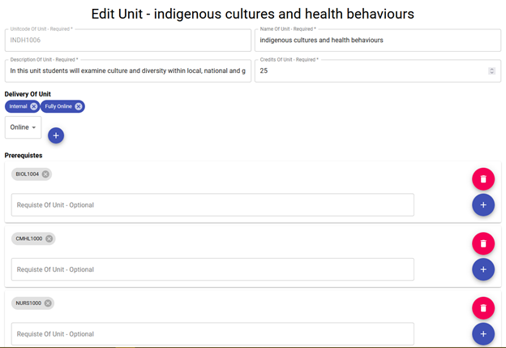

# Study Planner Staff User Manual

By Matthew Loe, Jonathan Wright, Andrew Li, Max Woodcock, Reuben Whibley

&nbsp;

## Contents
- [Introduction](##introduction)
- [Logging In and the Landing](#logging-In-and-the-landing)
- [Data Management](#data-management)
    - [Adding Data](#adding-data)
    - [Deleting Data](#deleting-data)
    - [Updating Data](#updating-data)
- [CSV Upload/Bulk Add](#csv-upload/bulk-add)
- [Adding Users with AWS Cognito](#adding-users-with-aws-cognito)
- [Appendix](#appendix)
    - [Appendix 1: Data Definitions](#appendix-1:-data-definitions)
        - [Career](#career)
        - [Major](#major)
        - [Specialization](#specialization)
        - [Trait](#trait)
    - [Appendix 2: CSV Format](#appendix-2:-csv-format)

&nbsp;

## Introduction

This document is a user manual relating to the use of the Content Management System (CMS) of the Curtin Medical Study Planner system. The CMS is the management system used to manage (add, update or delete) data used by the Study Planner product which is displayed to users and used to create the study plans.

This document and the CMS is intended for use only by authorised staff and personnel.

&nbsp;

## Logging In and the Landing

The login screen (shown below) is fairly simple and contains only a username and password field with a login button. There is no registration button as only the system administrator may add new users via the AWS Cognito service.

&nbsp;

&nbsp;

&nbsp;

After logging, the user will be shown the landing page which consists of several cards leading to the data management section for their respective data type and a collapsible sidebar located at the top of the page for navigation to the landing and other management sections as well. The sidebar is a consistent feature that is shown on all pages apart from the login page to allow for easy navigation of the CMS.

&nbsp;

&nbsp;

&nbsp;

## Data Management

The process for managing the four types of data, careers, majors, specializations and units, is very similar except for the information that each type of data has or needs when creating and updating, hence this document will go through the demonstration and explanation process using the unit data type and management section as the example and any differences will be clearly highlight and detailed.

From the landing page, the user may select one of four data management cards, career, major, specialization and unit. The CSV Upload card will be explored in a later section. Each data management part allows the user to conduct one of three data manipulation operations, create, update and delete. The management part also lists all currently stored data in the system and has a search/filter functionality to narrow down the list of data.

&nbsp;

&nbsp;

After selecting the unit management card, the user will be shown the page as seen above. The page displays to the user a list of all currently stored unit data in the system with a search bar that allows for easy filtering of the units by name, description or unit code and a button to create new units. For each unit, the unit name and description is displayed as part of the entry.

To view the detailed information of a unit, the unit entry can be clicked which will cause the page to display the current information for the selected unit and have two buttons, the edit button and the delete button as shown below.

&nbsp;

&nbsp;

## Adding Data

&nbsp;

&nbsp;

To create a new unit, the user can click on the Create button which will lead to the Create Unit page, which contains a set of required fields shown with an asterisk and in red initially, and other optional fields as shown above.

**Note: When adding new data, the code for the unit, major or specialization cannot already exist in the database.**

For the credits field, the number cannot be less than zero or an error will be returned. Decimal values are valid in the case of units with half credits.

The Delivery of Unit field is used to indicate whether the unit is conducted online or in person on the campus, with both options able to be selected at the same time. They can be added using the plus button and removed by clicking the cross next to the target item.

**Note: The Internal field check box from the Specialization create page refers instead to whether the specialization is internal to the course/school/department or not.**

&nbsp;

&nbsp;

For the prerequisite, corequisite and antirequisite fields, there is the option of adding a requisite path. After clicking the &#39;Add Requisite Path&#39;, units can be added to the path by entering the unit code and clicking the plus button as shown above, and entered units can be removed by clicking the cross button next to the target unit code. If the user wishes to remove a path entirely, the red trash can symbol can be clicked.

Additionally, if the unit has an alternative or multiple sets of requisites for the unit, this can be designated by adding a second path and listing the path&#39;s units, displaying a prerequisite example of such a case.

**Note: Multiple paths represent OR case. E.g a student must satisfy or have completed prerequisite path A or prerequisite path B in order to take the unit.**

Finally the unit can be created by clicking the create unit button. Any errors will be indicated to the user via a popup.

The process for the careers, specializations and majors is highly similar, however please note that units should be listed in the order they should be done in for specializations and majors, and for careers to ensure a specific major or specialization is added during the top down approach be specific when listing units.

&nbsp;

&nbsp;

## Deleting Data

In order to delete a unit, the target unit should be selected from the list which will lead to the detailed information of the unit being displayed and a delete button appearing near the bottom of the information on the page next to the edit button in red coloring.

After pressing the delete button, the user will be prompted to confirm the action in a popup as shown below, which will then cause the selected unit to be removed from the system when confirmed.

&nbsp;

&nbsp;

## Updating Data

In order to update a unit, the target unit should be selected from the list which will lead to the detailed information of the unit being displayed and an edit button appearing near the bottom of the information on the page next to the delete button in blue coloring.

After pressing the edit button, the user will be directed to a page showing all the unit fields with the current information already filled in for their respective fields as shown below in the example below. The user can then proceed to edit the unit information as needed and confirm the update by pressing the update button at the bottom of the page.

&nbsp;

&nbsp;

## CSV Upload/Bulk Add

To use the CSV upload function, which will bulk add multiple careers, majors, specializations and/or units, a CSV file containing valid data in the correct format must be first prepared. The format for the CSV can be found under [Appendix 2: CSV Format](#appendix-2:-csv-format).

From the Landing page, the CSV Upload card should be selected, which will direct the user to the CSV Upload page that contains a button named &#39;CSV Upload/Bulk Add&#39;. When clicked, the button will pop up a file chooser window. Upon selection the system will attempt to parse, validate and then add the various data to the system&#39;s database.

&nbsp;

&nbsp;

Should there be any errors to do with the file, the system will stop parsing and point out the line that the error occurred on to enable easy identification and correction by the user.

**Note: This operation may take a while to complete, so please be patient.**

## Adding Users - AWS Cognito

First you will need your AWS credentials, if you have forgotten your AWS credentials you can navigate to the [AWS support page and request a password reset](https://aws.amazon.com/premiumsupport/knowledge-center/recover-aws-password/).

Then you will need to logon to the [AWS Web Console](https://console.aws.amazon.com/console/home) using those credentials, your account ID will be in an email you received previously.

&nbsp;

&nbsp;

Then navigate to AWS Cognito either by searching it and selecting the red image as displayed below, or [click here to navigate there directly](https://ap-southeast-2.console.aws.amazon.com/cognito/users/?region=ap-southeast-2#/?_k=qje9cj). Once you have navigated to AWS Cognito be sure to select User Pools and either the Dev/Prod Staff User Pool.

&nbsp;

&nbsp;

Once in the pool you can select on the left hand side of the screen under General Settings, Users and Groups. From here you can create a user using the graphical interface. If you require assistance please read the [Cognito Documentation](https://docs.aws.amazon.com/cognito/latest/developerguide/managing-users.html)

&nbsp;

## Appendix

## Appendix 1: Data Definitions

Descriptions of data types used/stored by the system and their fields.

&nbsp;

### Career

| **Field** | **Type** | **Description** |
| --- | --- | --- |
| Name | Text | Name of career |
| Description | Text | Description of career |
| Industry | Text | Type of industry that the career belongs to |
| Requirements | List of Unit Codes | List of unit codes representing units that would lead to the career |
| Traits | List of Trait Names | List of personality traits that would be compatible with the career |

&nbsp;

### Major

| **Field** | **Type** | **Description** |
| --- | --- | --- |
| Major Code | Text | Code representing the designation of the major |
| Name | Text | Name of major |
| Description | Text | Description of the major |
| Credits | Number | Total number of credits for the major |
| Units | List of Unit Codes | List of unit codes representing units within the major |
| Unit Antirequisites | List of Unit Codes | List of unit codes representing units that are incompatible with the major |
| Specialization Antirequisites | List of Specialization Codes | List of specialization codes representing specializations that are incompatible with the major |

&nbsp;

### Specialization

| **Field** | **Type** | **Description** |
| --- | --- | --- |
| Specialization Code | Text | Code representing the designation of the specialization |
| Name | Text | Name of specialization |
| Description | Text | Description of the specialization |
| Credits | Number | Total number of credits for the specialization |
| Internal | True/False | Indicator determining whether the specialization is internal to the school/course |
| Units | List of Unit Codes | List of unit codes representing units within the specialization |
| Unit Antirequisites | List of Unit Codes | List of unit codes representing units that are incompatible with the specialization |
| Specialization Antirequisites | List of Specialization Codes | List of specialization codes representing specializations that are incompatible with the specialization |

&nbsp;

### Trait

| **Field** | **Type** | **Description** |
| --- | --- | --- |
| Name | Text | Name of trait |

&nbsp;

### Unit

| **Field** | **Type** | **Description** |
| --- | --- | --- |
| Unit Code | Text | Code representing the designation of the unit |
| Name | Text | Name of unit |
| Description | Text | Description of the unit |
| Credits | Number | Total number of credits for the unit |
| Delivery | Text | Format(s) in which unit content is delivered to students |
| Corequisites | List of Unit Codes | List of unit codes representing units that need to be taken at the same time as the unit |
| Antirequisites | List of Unit Codes | List of unit codes representing units that are incompatible with the unit |
| Prerequisites | List of Unit Codes | List of unit codes representing units that must be previously completed to take the unit |

&nbsp;

## Appendix 2: CSV Format

### CSV Format

- DATATYPE
- PROPERTIES ...

&nbsp;

### Unit Definition

- UNIT
- UNITCODE
- UNIT TITLE
- UNIT DESCRIPTION
- CREDITS
- DELIVERY TYPE (e.g. internal,fully online,...)
- PREREQUISITES (entered as groups, to split into a new group (i.e OR path) use a semicolon else its comma separated)
- COREQUISITES (entered as groups, to split into a new group (i.e OR path) use a semicolon else its comma separated)
- ANTIREQUISITES (entered as groups, to split into a new group (i.e OR path) use a semicolon else its comma separated)

&nbsp;

### Major Definition

- MAJOR
- MajorCode
- Name
- Description
- Credits
- Units (CSV separated)
- UnitAntiReqs (entered as groups, to split into a new group (i.e OR path) use a semicolon else its comma separated)
- SpecAntiReqs (entered as groups, to split into a new group (i.e OR path) use a semicolon else its comma separated)

&nbsp;

### Specialization Definition

- SPECIALIZATION
- SpecCode
- Name
- Description
- Credits
- InternalSpecialization (FALSE/TRUE)
- Units (CSV separated)
- UnitAntiReqs (entered as groups, to split into a new group (i.e OR path) use a semicolon else its comma separated)
- SpecAntiReqs (entered as groups, to split into a new group (i.e OR path) use a semicolon else its comma separated)
- MajorAntiReqs (entered as groups, to split into a new group (i.e OR path) use a semicolon else its comma separated)

&nbsp;

### Career Definition

- CAREER
- Name
- Description
- Industry
- UnitRequirements (CSV separated)
- Traits (CSV separated)